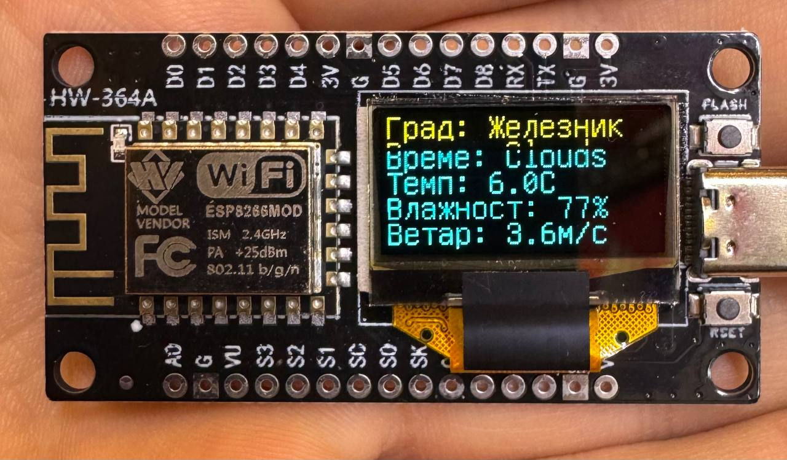

# ESP8266 OLED Weather Station with Serbian Cyrillic Support

Real-time weather station using ESP8266 NodeMCU and OLED display, showing weather data in Serbian Cyrillic. The device fetches current weather conditions from OpenWeatherMap API and displays temperature, humidity, wind speed, and weather conditions.



## Hardware Requirements

- NodeMCU ESP8266 V3 Development Board
- 0.96 Inch OLED Display (SSD1306)
- USB Type-C Cable for programming
- Power source (USB or external)

## Features

- Real-time weather data display
- Serbian Cyrillic character support
- Displays:
  - City name (Град)
  - Current weather (Време)
  - Temperature (Температура)
  - Humidity (Влажност)
  - Wind speed (Ветар)
- Auto-updates every 60 seconds

## Dependencies

- [U8g2lib](https://github.com/olikraus/u8g2) - For OLED display
- [ESP8266WiFi](https://github.com/esp8266/Arduino/tree/master/libraries/ESP8266WiFi)
- [ESP8266HTTPClient](https://github.com/esp8266/Arduino/tree/master/libraries/ESP8266HTTPClient)
- [ArduinoJson](https://arduinojson.org/)

## Installation

1. Install Arduino IDE
2. Add ESP8266 board support:
   - Open Arduino IDE
   - Go to File -> Preferences
   - Add `http://arduino.esp8266.com/stable/package_esp8266com_index.json` to Additional Board URLs
   - Go to Tools -> Board -> Boards Manager
   - Search for ESP8266 and install

3. Install required libraries:
   - Go to Tools -> Manage Libraries
   - Install U8g2lib
   - Install ArduinoJson

## Configuration

1. Get your API key from [OpenWeatherMap](https://openweathermap.org/api)
2. Copy `config.h.example` to `config.h`
3. Update the configuration variables in `config.h`:
```cpp
#define WIFI_SSID "YOUR_WIFI_SSID"
#define WIFI_PASSWORD "YOUR_WIFI_PASSWORD"
#define OWM_API_KEY "YOUR_API_KEY"
#define OWM_LOCATION "YOUR_CITY"  // Default: Zeleznik
#define DISPLAY_CITY "YOUR_CITY_IN_CYRILLIC"  // Default: Железник
```

## Wiring

Connect OLED display to NodeMCU:
- SCL -> D6 (GPIO12)
- SDA -> D5 (GPIO14)
- VCC -> 3.3V
- GND -> GND

## Usage

1. Connect your NodeMCU to your computer
2. Select correct board and port in Arduino IDE:
   - Board: "NodeMCU 1.0 (ESP-12E Module)"
   - Upload Speed: "115200"
   - Port: Select the appropriate COM port
3. Upload the code
4. The display will show "Иницијализација..." and then start showing weather data

## Troubleshooting

- If display shows dots instead of Cyrillic characters:
  - Verify U8g2lib is properly installed
  - Check if you're using the correct font
- If weather data isn't updating:
  - Verify your WiFi credentials
  - Check your API key
  - Ensure location name is correct

## Contributing

Feel free to fork this project and submit pull requests. You can also open issues for bugs or feature requests.

## License

This program is free software: you can redistribute it and/or modify it under the terms of the GNU General Public License as published by the Free Software Foundation, either version 3 of the License, or (at your option) any later version.

This program is distributed in the hope that it will be useful, but WITHOUT ANY WARRANTY; without even the implied warranty of MERCHANTABILITY or FITNESS FOR A PARTICULAR PURPOSE. See the GNU General Public License for more details.

You should have received a copy of the GNU General Public License along with this program. If not, see <https://www.gnu.org/licenses/>.

## Acknowledgments

- OpenWeatherMap for weather data API
- U8g2 library for display support
- ESP8266 community for their excellent documentation